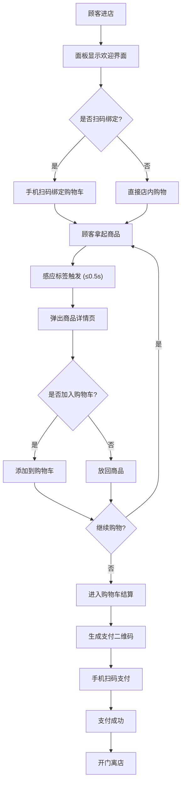

## 1. 产品概述

面向线下情趣用品无人零售店的管理与交互面板系统，解决顾客自助购物体验与商家数据运营管理的双重需求，通过智能感应技术与可视化数据分析，实现24小时无人值守的私密化零售新模式。

- 核心价值：为顾客提供私密、便捷、无接触的自助购物体验；为商家提供实时监控、智能分析、高效决策的运营数据平台
- 目标用户：店内顾客（自助购物）、商家运营者（数据分析与管理）

## 2. 核心功能

### 2.1 用户角色

| 角色 | 进入方式 | 核心权限 |
|------|----------|----------|
| 顾客 | 店内扫码/直接交互面板 | 商品浏览、购物车管理、扫码绑定手机、无接触支付 |
| 商家管理员 | 后台登录入口 | 实时监控、数据分析、热力图查看、数据导出 |

### 2.2 功能模块

**顾客端：**
1. **首页/扫码绑定页**：二维码展示区域、店铺欢迎界面、购物状态提示
2. **商品感应详情页**：实时弹出的商品信息卡片，包含功能说明、材质、防水等级、充电方式、噪音数据
3. **购物车管理界面**：商品列表、数量调整、移除商品、总价计算
4. **支付结算页**：支付二维码、订单确认、离店指引

**商家后台：**
1. **实时监控仪表盘**：货架拿取率、成交转化率、核心指标概览
2. **商品行为分析模块**：高拿起低购买列表、高转化率排行榜、特征分析
3. **营业数据可视化系统**：分时段客流量热力图、分时段销售额热力图（日/周/月切换）
4. **数据导出中心**：Excel/CSV格式导出

### 2.3 页面详情

| 页面名称 | 模块名称 | 功能描述 |
|-----------|-------------|---------------------|
| 顾客首页 | 扫码绑定区域 | 展示动态二维码，手机扫码后绑定购物车状态 |
| 顾客首页 | 店铺欢迎区 | 店铺介绍、营业时间、温馨提示 |
| 顾客首页 | 实时感应区 | 商品拿取感应提示、商品列表概览 |
| 商品详情弹窗 | 商品基本信息 | 商品名称、图片、价格、SKU编码 |
| 商品详情弹窗 | 功能说明区 | 完整功能说明与使用指南，折叠展示 |
| 商品详情弹窗 | 参数规格区 | 材质（硅胶/ABS/TPE/玻璃等）、防水等级（IPX7等）、充电方式、噪音分贝 |
| 购物车页面 | 商品列表 | 商品缩略图、名称、单价、数量选择器、小计金额 |
| 购物车页面 | 操作区 | 移除商品、清空购物车、继续购物按钮 |
| 购物车页面 | 结算区 | 商品合计、优惠金额、应付金额、去结算按钮 |
| 支付结算页 | 订单信息 | 订单编号、商品清单、应付金额 |
| 支付结算页 | 支付区 | 微信/支付宝二维码、支付状态轮询 |
| 商家仪表盘 | 核心指标卡片 | 今日客流量、今日销售额、拿取率、转化率、客单价 |
| 商家仪表盘 | 货架监控区 | 各货架拿取数量柱状图、成交转化率对比 |
| 商品分析页 | 高拿起低购买列表 | 商品排名、拿取次数、购买次数、转化率、差值占比 |
| 商品分析页 | 高转化率排行榜 | TOP商品列表、转化率、特征标签 |
| 热力图页面 | 客流量热力图 | 24小时/每小时粒度热力图，按天/周/月切换 |
| 热力图页面 | 销售额热力图 | 分时段销售额热力图，悬浮显示具体数值 |
| 数据导出页 | 导出配置区 | 数据类型选择、时间范围选择、格式选择（Excel/CSV） |
| 数据导出页 | 历史导出记录 | 已导出文件列表、下载按钮 |

## 3. 核心流程

### 3.1 顾客购物流程
顾客进店 → 面板显示欢迎界面 → 可选择扫码绑定手机 → 浏览货架拿起商品 → 面板感应弹出商品详情（0.5秒内响应）→ 查看详情后决定是否购买 → 加入购物车 → 购物车确认 → 生成支付二维码 → 手机扫码支付 → 支付成功 → 开门离店

### 3.2 商家管理流程
管理员登录后台 → 查看实时仪表盘（每分钟自动更新）→ 切换到商品分析模块 → 查看高拿起低购买商品/高转化率排行 → 切换到热力图页面 → 选择时间维度（日/周/月）查看客流量/销售额 → 选择需要的数据类型 → 设置时间范围 → 导出Excel/CSV文件

### 3.3 Mermaid流程图

## 4. 用户界面设计

### 4.1 设计风格

**顾客端设计风格：私密优雅暗色主题**
- 主色调：深紫色渐变 `#6B21A8 → #4C1D95`（神秘优雅，符合场景隐私需求）
- 辅助色：柔粉色 `#F9A8D4`（提示高亮）、暖金色 `#FBBF24`（强调）
- 中性色：深灰黑 `#0F172A` 背景、`#1E293B` 卡片、`#94A3B8` 次级文字、`#F8FAFC` 主文字
- 按钮样式：圆角胶囊形，渐变填充，微悬浮阴影
- 字体：主标题使用 Noto Serif SC（优雅衬线），正文使用 Noto Sans SC（清晰易读）
- 布局风格：卡片式布局，大留白，玻璃态模糊效果
- 图标风格：lucide线性图标，柔和渐变填充

**商家后台设计风格：专业数据暗色主题**
- 主色调：深蓝青 `#0EA5E9 → #0284C7`（专业可信）
- 辅助色：成功绿 `#10B981`、警告橙 `#F59E0B`、危险红 `#EF4444`
- 中性色：`#0B1120` 背景、`#1E293B` 卡片、`#64748B` 次级文字、`#F1F5F9` 主文字
- 按钮样式：直角微圆角，扁平设计，边框细线条
- 字体：全部使用 JetBrains Mono + Noto Sans SC（数据易读性）
- 布局风格：网格化仪表盘布局，紧凑高效，最小必要留白
- 图标风格：lucide线性图标，单色极简

### 4.2 页面设计概述

| 页面名称 | 模块名称 | UI元素 |
|-----------|-------------|----------|
| 顾客首页 | 扫码绑定区域 | 居中大尺寸二维码卡片，玻璃态背景，脉冲动画，绑定状态指示 |
| 顾客首页 | 店铺欢迎区 | 大标题渐显动画，温馨提示文字，营业状态徽章 |
| 商品详情弹窗 | 商品基本信息 | 从右侧滑入动画，商品图片模糊处理（隐私保护），点击可查看清晰图 |
| 商品详情弹窗 | 参数规格区 | 图标+标签形式展示，4个规格卡片网格排列，悬停高亮 |
| 购物车页面 | 商品列表 | 左滑删除手势，数量步进器，平滑过渡动画 |
| 商家仪表盘 | 核心指标卡片 | 5个卡片横排，数值+趋势小图表，数据刷新动效 |
| 商品分析页 | 排行榜列表 | 排名徽章，进度条转化率可视化，特征标签云 |
| 热力图页面 | 热力图区域 | 色块矩阵，颜色越深数值越高，悬停显示tooltip精确数值 |
| 数据导出页 | 导出配置区 | 表单选择器，日期范围选择，实时预览导出数量 |

### 4.3 响应式设计

- **桌面优先**：主要适配店内大屏面板（1920×1080及以上），兼顾平板（768px）和手机（375px）
- 顾客端：大屏面板模式（横向布局）→ 手机扫码后移动模式（纵向布局）
- 商家后台：桌面端完整仪表盘 → 平板端双列布局 → 手机端单列滚动
- 触摸优化：大尺寸按钮（最小48×48px），手势支持（滑动删除、下拉刷新）

### 4.4 隐私保护设计

- 商品图片默认模糊处理，点击「查看详情」才显示清晰图
- 商品详情页文字使用柔和配色，避免过于直白的描述
- 界面无过度暴露的商品展示，顾客操作区域自动淡化背景
- 顾客离开后自动清除购物车状态，不留存隐私信息
- 支付过程使用一次性二维码，支付完成立即失效
