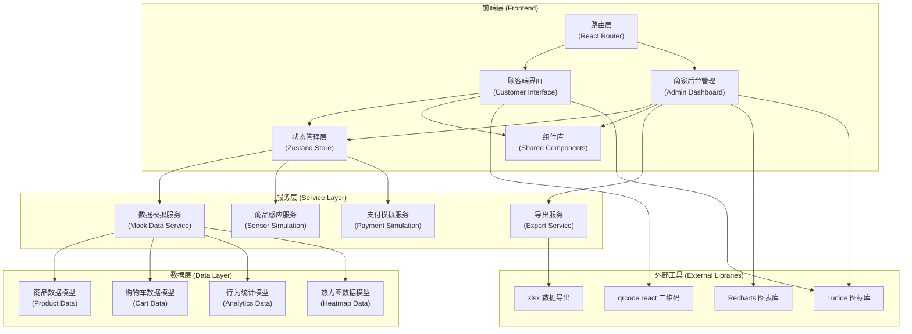
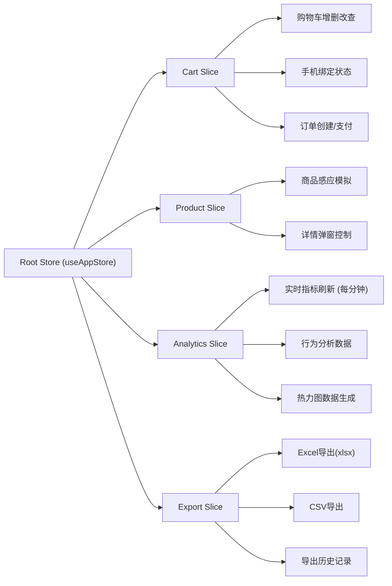

## 1. 架构设计



## 2. 技术说明

- **前端框架**: React 18 + TypeScript + Vite 6
- **样式方案**: Tailwind CSS 3.4（CSS变量主题系统）
- **路由管理**: React Router DOM 6
- **状态管理**: Zustand 4（轻量级状态管理，支持分片状态）
- **图表可视化**: Recharts 2（React原生图表库，性能优秀）
- **图标系统**: Lucide React（线性图标，风格统一）
- **数据导出**: xlsx (SheetJS) + 原生Blob CSV导出
- **二维码生成**: qrcode.react
- **数据层**: 纯前端Mock数据，定时生成器模拟实时数据流
- **后端服务**: 纯前端实现（无后端依赖），所有数据通过localStorage持久化+内存模拟

## 3. 路由定义

| 路由路径 | 页面组件 | 用途说明 |
|----------|---------|---------|
| `/` | `CustomerHome` | 顾客端首页（扫码绑定 + 欢迎界面） |
| `/cart` | `CustomerCart` | 顾客购物车管理页面 |
| `/checkout` | `CustomerCheckout` | 支付结算页面 |
| `/admin` | `AdminDashboard` | 商家后台仪表盘（默认重定向到此） |
| `/admin/dashboard` | `AdminDashboard` | 实时监控仪表盘 |
| `/admin/analytics` | `AdminAnalytics` | 商品行为分析模块 |
| `/admin/heatmap` | `AdminHeatmap` | 24小时营业热力图 |
| `/admin/export` | `AdminExport` | 数据导出中心 |
| `*` | `NotFound` | 404页面（返回首页） |

## 4. 模块类型定义

```typescript
// ========== 商品相关 ==========
interface Product {
  id: string;
  sku: string;
  name: string;
  price: number;
  originalPrice?: number;
  image: string;
  category: string;
  tags: string[];
  description: string;
  usageGuide: string;
  specifications: {
    material: '硅胶' | 'ABS' | 'TPE' | '玻璃' | '金属' | '其他';
    materialDetail: string;
    waterproof: 'IPX4' | 'IPX5' | 'IPX6' | 'IPX7' | 'IPX8' | '不防水';
    charging: 'USB-C' | 'Micro-USB' | '无线充电' | '电池' | '无需充电';
    noise: string; // 例如 "35-45分贝"
    [key: string]: string;
  };
  shelfId: string;
  inStock: boolean;
}

// ========== 购物车相关 ==========
interface CartItem {
  productId: string;
  product: Product;
  quantity: number;
  addedAt: number;
}

interface Cart {
  sessionId: string;
  items: CartItem[];
  boundPhone?: string;
  createdAt: number;
  updatedAt: number;
}

// ========== 订单相关 ==========
interface Order {
  id: string;
  sessionId: string;
  items: CartItem[];
  totalAmount: number;
  discountAmount: number;
  finalAmount: number;
  status: 'pending' | 'paid' | 'failed' | 'cancelled';
  paymentMethod?: 'wechat' | 'alipay';
  createdAt: number;
  paidAt?: number;
}

// ========== 行为分析相关 ==========
interface ProductBehavior {
  productId: string;
  product: Product;
  pickupCount: number;    // 被拿起次数
  purchaseCount: number;  // 被购买次数
  conversionRate: number; // 转化率
  avgViewDuration: number; // 平均查看时长(秒)
}

interface ShelfMonitor {
  shelfId: string;
  shelfName: string;
  totalPickups: number;
  totalPurchases: number;
  conversionRate: number;
}

interface RealtimeMetrics {
  todayCustomers: number;
  todayRevenue: number;
  overallPickupRate: number;
  overallConversionRate: number;
  avgOrderValue: number;
  lastUpdated: number;
}

// ========== 热力图相关 ==========
interface HourlyData {
  hour: number;        // 0-23
  customers: number;   // 客流量
  revenue: number;     // 销售额
}

interface HeatmapData {
  date: string;
  hourlyData: HourlyData[];
}

type HeatmapDimension = 'day' | 'week' | 'month';
type HeatmapType = 'customers' | 'revenue';

// ========== 导出相关 ==========
interface ExportConfig {
  type: 'metrics' | 'behavior' | 'heatmap' | 'orders';
  dateRange: { start: string; end: string };
  format: 'xlsx' | 'csv';
}

interface ExportRecord {
  id: string;
  fileName: string;
  type: string;
  format: string;
  createdAt: number;
  size: number;
}

// ========== 状态管理Store ==========
interface AppState {
  // 顾客端
  cart: Cart | null;
  activeProduct: Product | null;
  isDetailModalOpen: boolean;
  currentOrder: Order | null;
  isPhoneBound: boolean;
  
  // 商家端
  realtimeMetrics: RealtimeMetrics;
  productBehaviors: ProductBehavior[];
  shelfMonitors: ShelfMonitor[];
  heatmapData: HeatmapData[];
  exportRecords: ExportRecord[];
  
  // Actions
  bindPhone: (phone: string) => void;
  showProductDetail: (product: Product) => void;
  closeProductDetail: () => void;
  addToCart: (productId: string, quantity?: number) => void;
  removeFromCart: (productId: string) => void;
  updateCartQuantity: (productId: string, quantity: number) => void;
  clearCart: () => void;
  createOrder: () => Order;
  simulatePayment: (orderId: string, method: 'wechat' | 'alipay') => Promise<boolean>;
  
  refreshMetrics: () => void;
  refreshHeatmap: (dimension: HeatmapDimension) => void;
  exportData: (config: ExportConfig) => Promise<ExportRecord>;
  
  // 模拟感应
  simulateProductPickup: () => void;
  startAutoSimulation: () => void;
  stopAutoSimulation: () => void;
}
```

## 5. 项目目录结构

```
d:\proje\label-094/
├── src/
│   ├── components/              # 可复用组件
│   │   ├── customer/            # 顾客端专用组件
│   │   │   ├── QRCodePanel.tsx      # 二维码绑定面板
│   │   │   ├── ProductDetailModal.tsx # 商品详情弹窗
│   │   │   ├── ProductCard.tsx      # 商品卡片
│   │   │   ├── CartItem.tsx         # 购物车条目
│   │   │   ├── SensorIndicator.tsx  # 感应指示器
│   │   │   └── PaymentQRCode.tsx    # 支付二维码
│   │   ├── admin/               # 管理端专用组件
│   │   │   ├── MetricCard.tsx       # 指标卡片
│   │   │   ├── ConversionChart.tsx  # 转化率图表
│   │   │   ├── BehaviorRankList.tsx # 行为排行榜
│   │   │   ├── HeatmapGrid.tsx      # 热力图网格
│   │   │   └── ExportConfigForm.tsx # 导出配置表单
│   │   └── shared/              # 通用组件
│   │       ├── PageLayout.tsx       # 页面布局
│   │       ├── NavBar.tsx           # 导航栏
│   │       ├── CustomerNavBar.tsx   # 顾客端导航
│   │       ├── AdminSidebar.tsx     # 管理端侧边栏
│   │       ├── Button.tsx           # 按钮组件
│   │       └── Badge.tsx            # 徽章组件
│   ├── pages/                   # 页面组件
│   │   ├── customer/
│   │   │   ├── Home.tsx
│   │   │   ├── Cart.tsx
│   │   │   └── Checkout.tsx
│   │   ├── admin/
│   │   │   ├── Dashboard.tsx
│   │   │   ├── Analytics.tsx
│   │   │   ├── Heatmap.tsx
│   │   │   └── Export.tsx
│   │   └── NotFound.tsx
│   ├── store/                   # 状态管理 (Zustand)
│   │   ├── useAppStore.ts          # 主Store
│   │   └── slices/
│   │       ├── cartSlice.ts
│   │       ├── productSlice.ts
│   │       ├── analyticsSlice.ts
│   │       └── exportSlice.ts
│   ├── data/                    # 模拟数据
│   │   ├── products.ts            # 商品数据
│   │   ├── mockGenerator.ts       # 数据生成器
│   │   └── initialData.ts         # 初始化数据
│   ├── utils/                   # 工具函数
│   │   ├── formatters.ts          # 格式化工具
│   │   ├── exportUtils.ts         # 导出工具
│   │   └── randomUtils.ts         # 随机数工具
│   ├── hooks/                   # 自定义Hooks
│   │   ├── useRealtimeUpdate.ts   # 实时更新Hook
│   │   ├── useSensorSimulator.ts  # 感应模拟Hook
│   │   └── useHeatmapData.ts      # 热力图数据Hook
│   ├── styles/                  # 全局样式
│   │   ├── globals.css
│   │   └── themes.css
│   ├── types/                   # 类型定义
│   │   └── index.ts
│   ├── App.tsx
│   ├── main.tsx
│   └── vite-env.d.ts
├── public/
├── .trae/
│   └── documents/
│       ├── PRD.md
│       └── TECHNICAL_ARCHITECTURE.md
├── package.json
├── tsconfig.json
├── tsconfig.node.json
├── vite.config.ts
├── tailwind.config.js
├── postcss.config.js
├── index.html
└── .gitignore
```

## 6. 状态管理分片设计



## 7. 关键技术决策

### 7.1 数据模拟方案
- **内存数据源**：全部数据存储在内存对象中，通过localStorage实现会话持久化
- **定时生成器**：`setInterval` 每60秒触发指标更新，模拟实时数据流
- **随机算法**：使用正态分布随机数生成符合真实业务规律的数据（晚间高峰、工作日vs周末差异）
- **商品感应模拟**：`setInterval` 随机3-10秒触发一次「商品拿起」事件，模拟真实顾客行为

### 7.2 性能优化
- **Zustand选择器**：使用 `useAppStore(state => state.xxx)` 选择器避免不必要重渲染
- **组件拆分**：每个功能组件 < 300行，细粒度拆分确保渲染性能
- **图表优化**：Recharts使用纯SVG渲染，数据变化时只更新delta部分
- **防抖节流**：感应事件使用防抖，支付状态轮询使用节流

### 7.3 隐私保护实现
- **图片模糊**：CSS `filter: blur(20px)` 默认状态，hover或点击后移除blur
- **状态清除**：订单完成/页面关闭时自动调用 `localStorage.clear()`
- **无痕模式**：购物车数据仅存在内存，不写入持久化存储（除非主动绑定手机）
